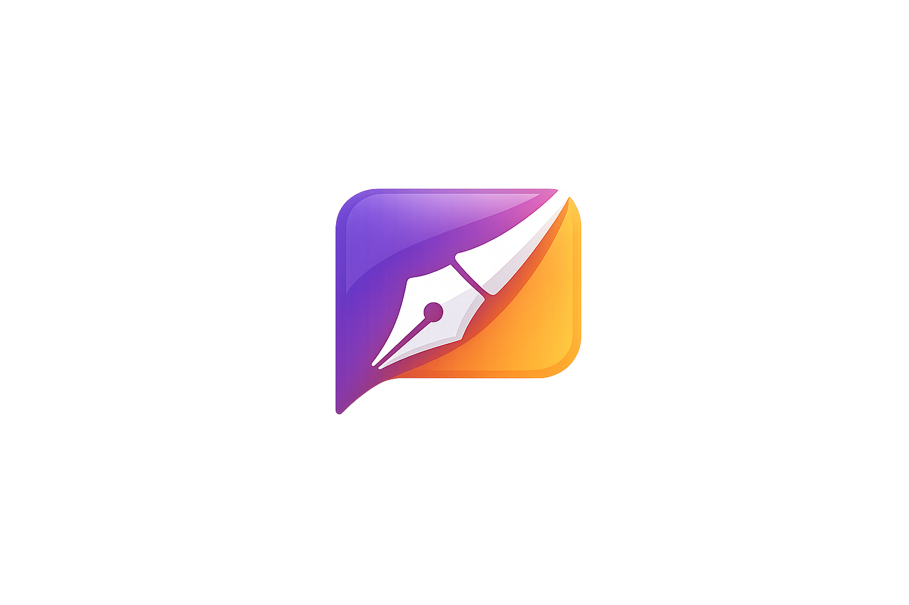

# LaravelBlog

<p align="center">
  
</p>

LaravelBlog é uma aplicação web de blog/rede social construída com **Laravel 12**, **Blade**, **Tailwind CSS**, **Alpine.js** e **Vite**. O projeto permite criar publicações, pesquisar no feed, curtir, salvar, comentar e gerenciar perfil com avatar.

## Imagens do projeto

<p align="center">
  
</p>

<p align="center">
  
</p>

> As imagens acima são assets versionados do próprio projeto. Depois de publicar o repositório, você também pode adicionar capturas de tela reais da tela inicial, feed e perfil nesta seção.

## Funcionalidades

- Autenticação completa com cadastro, login, confirmação de senha, verificação de e-mail e redefinição de senha.
- Feed autenticado com paginação e pesquisa de publicações.
- CRUD de posts com geração de slugs únicos.
- Curtidas, posts salvos e comentários.
- Perfil do usuário com edição de dados, atualização de senha, exclusão da conta e upload de avatar.
- Layout responsivo com componentes Blade reutilizáveis e ícones Lucide.
- Testes automatizados para autenticação, perfil, posts, comentários e interações.

## Tecnologias

- PHP 8.2 ou superior
- Laravel 12
- Composer
- Node.js e npm
- Vite
- Tailwind CSS
- Alpine.js
- MySQL por padrão no `.env.example`

## Pré-requisitos

Antes de começar, instale:

- PHP com extensões comuns do Laravel habilitadas (`mbstring`, `openssl`, `pdo`, `tokenizer`, `xml`, `ctype`, `json`, `fileinfo`).
- Composer.
- Node.js 20+ e npm.
- MySQL/MariaDB ou outro banco compatível configurado no `.env`.

## Como rodar o projeto localmente

Clone o repositório e entre na pasta:

```bash
git clone <url-do-repositorio>
cd LaravelBlog